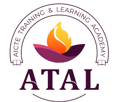

# Recent Advances and Challenges in Artificial Intelligence, Machine Learning & Blockchain Technology (RACAMBT) - 2023 
      
   
   

      
    

 <h1> AICTE-ATAL: A Two-Weeks Hybrid Faculty Development Program </h1>

    
    

## Research Articles/Papers

- **Article 1:** [Medical Records Management Using Distributed Ledger and Storage](Articles/AVV_2021_Medical_Records_Management_Using_Distributed_Ledger_and_Storage.pdf)
- **Article 2:** [Digital Supply Chain Management Using AI, ML and Blockchain](Articles/2022_Digital_Supply_Chain_Management_Using_AI_ML_and_Blockchain.pdf)
- **Article 3:** [Machine learning for blockchain: Future and challenges](Articles/2021_Machine_learning_in_for_blockchain_Future_and_challenges.pdf)
- **Article 4:** [Blockchain for AI: Review and Open Research Challenges](Articles/2019_Blockchain_for_AI_Review_and_Open_Research_Challenges.pdf)

## Online  

| Slot | Day 1   (27th Feb - Mon)    | Day 2   (28th Feb - Tue)    | Day 3   (1st Mar - Wed)    | Day 4   (2nd Mar - Thu)    | Day 5   (3rd Mar - Fri)    | Day 6   (4th Mar - Sat)    |
|:----:|:-----:|:-----:|:-----:|:-----:|:-----:|:-----:|
|     **7:00-7:50 PM** |   |     |    |    |    |   | 
|    **8:00-8:50 PM** |   |     |    |    |    |   | 
|    **9:00-9:30 PM** |  |  | |  |  |  | 

## Offline  

| Slot | Day 1   (6th Mar - Mon)  | Day 2   (7th Mar - Tue) | Day 3   (8th Mar - Wed) | Day 4   (9th Mar - Thu) | Day 5   (10th Mar - Fri) | 
|:----:|:------:|:-----:|:-----:|:-----:|:-----:|
| **FN**    **9:00 - 9:30 AM** |     | | | | | 
| **FN**   **9:30 - 12:00 PM**  |     |     |      |     |    |
| **Noon**   **12:00 - 1:00 PM**  |      |     |    |    |       |
| **Lunch**   **1:00 - 2:00 PM**   |    |    |    |    |    |
| **AN**   **2:00 - 4:30 PM**  |     |    |    |    |    |
| **AN**   **3:00 - 4:00 PM**   |  |  |  | |     |
| **AN**   **4:00 - 5:00 PM** |  |  | | |       | 

## Session Details 

 | Date & Session | Resource Person & Topic |
 |:-------|:-----------------------|
 |       | [Mr. Venkata Sai Charan Putrevu](RP/Saicharan), PMRF Research Scholar, IIT Kanpur   **Challenges in detection and attribution of Advanced Persistent Threats**           |
 |       | [Dr. Vasudevan AR](RP/Vasu), Assistant Professor, NIT Calicut   **Machine Learning and Intrusion Detection System**           |
 |       | [Prof. Avishek Adhikari](RP/Avishek), Head of Dept., Presidency University, Kolkata   **Public Key Cryptography and its Application in Blockchain Technology**         |
 |       | [Ms. Gandavaram Anuhya](RP/Anu), Blockchain Developer, Param Networks, Bengaluru   **Blockchain Technology and Cryptocurrency**        |
 |       | [Dr. Vasily Sachnev](RP/Vasily), Associate Professor, The Catholic University of Korea   **A New Approach for JPEG Steganalysis with a Cognitive Evolving Ensembler and Robust Feature Selection**        |
 |       |  [Dr. Sivagami R](RP/Sivagami), Research Associate, Amrita Vishwa Vidyapeetham, Coimbatore   **Deep Dive into Deep Learning**        |
 |        | [Dr. Mayank Agarwal](RP/Mayank), Assistant Professor, Dept. of CSE, IIT Patna   **802.11 Wireless Vulnerabilities, Concepts and Exploits**          |
 |      |   [Prof. Jubilant J Kizhakkethottam](RP/Jubilant), Lead - Blockchain Lab, Saintgits College of Engineering, Kottayam   **Blockchain Implementations in IoT for Supply Chain Management**         |
 |       | [Dr. Anoop V S](RP/Anoop), Research Officer, Kerala University of Digital Sciences, Thiruvananthapuram   **Natural Language Processing for Improving Public Health**          |
 |       | [Mr. Aju Mathew Thomas](RP/Aju), Cyber Security Consultant, Ernst & Young, Bengaluru   **Decentralized Identifiers in Blockchain Technology**         |
 |      | [Mr. Maharaj M](RP/Maharaj), Founder and CEO, BCBUZZ Technologies, Coimbatore   **Recent Challenges in Enterprise Blockchain Projects**        |
 |      | [Dr. Sivagami R](RP/Sivagami), Research Associate, Amrita Vishwa Vidyapeetham   **Hands-On: Image Analysis using Deep Learning Techniques**          |
 |      | [Mr. Ramaguru Radhakrishnan](RP/Ram), Assistant Professor, Amrita Vishwa Vidyapeetham, Coimbatore   **Hands-On: Smart Contract Implementation using Solidity**         |
 |      | [Mr. Vigneswaran R](RP/Vigneswaran), Consultant, Cybersecurity and Privacy Research & Innovation group, TCS   **Smart Contract Auditing**        |
 |      | [Mr. Alex Neelankavil Devassy](RP/Alex), Senior Security Consultant, Ernst & Young, Thiruvananthapuram   **Blockchain Application Security**        |
 |      | [Dr. Sangeetha V](RP/Sangeetha), Asst. Professor (Gr-I), BITS, Pilani - WILP Division, Bengaluru    **Securing AI Models: A Case Study on ChatGPT**         |
 |      | [Mr. Sivadanam Yaswanth Lingam](RP/Yaswanth), Cyber Security Analyst, Groww, Bengaluru   **Implications of GDPR on Blockchain Technology**         |
 |      | [Prof. Amit Agarwal](RP/Amit), Dept. of EEE, Amrita Vishwa Vidyapeetham, Coimbatore   **Challenges in Adopting Blockchain Technology**              |
 
######  Last Updated: 05-Feb-2023
